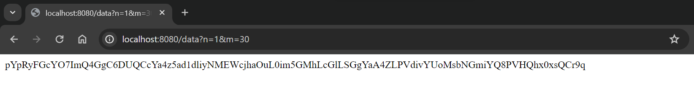
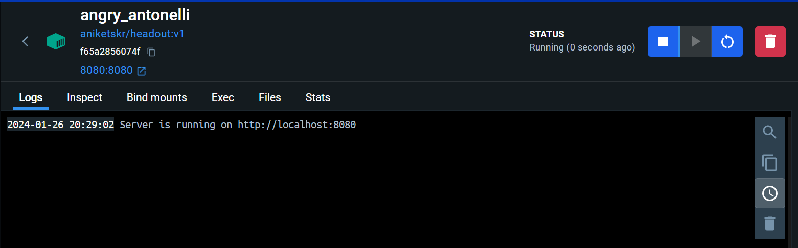
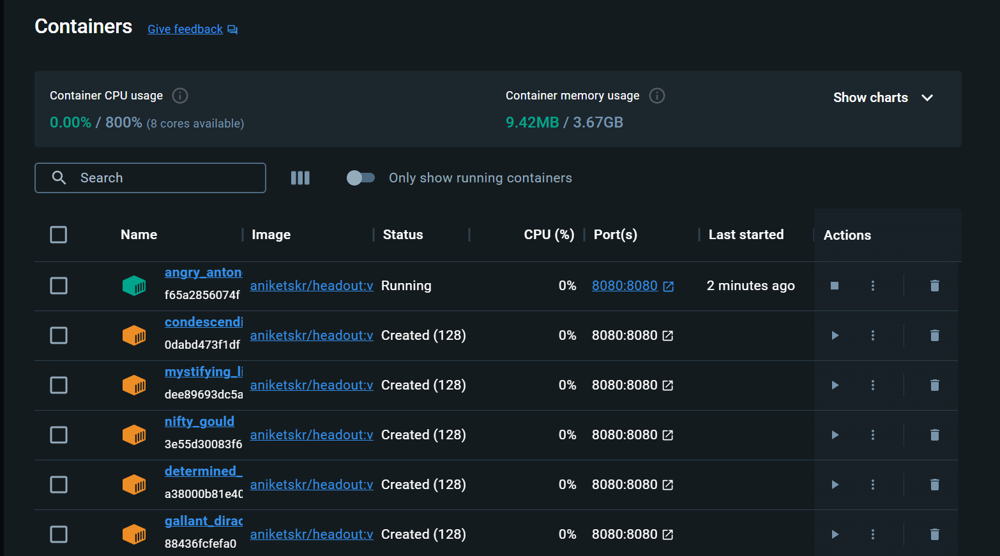

# Headout - Software Engineer, Intern - Assignment

## Screenshots

- Chrome local host :-



- Docker terminal :-



- Docker container :-



## Installation

1. Clone the repository to your local machine.

   ```sh
   git clone https://github.com/aniket-24/Headout_Intern_Assignment.git
   ```

2. Install the required packages.

   ```sh
   cd Headout_Intern_Assignment
   npm install
   ```

3. Start the development server.

   ```sh
   node server.js
   ```

4. Open the project in your browser at [`http://localhost:8080`](http://localhost:8080) to view your project.

## Coding Question: Optimize HTTP Server

### Problem Statement:

You are tasked with implementing a simple HTTP server with the following requirements.

### Implementation requirements

- Set up an HTTP server in a language/framework of your choice.
- The server should respond to incoming GET requests on the endpoint /data.
- You must accept 2 query params, n: file name, and m: line number.
- If n and line both are provided, return the content of file /tmp/data/n.txt at line number m.
- If only n is provided, return the contents of file /tmp/data/n.txt entirely.
- Each file should be around 100MB in size, there will be more than 30 different files (eg; 1.txt, 2.txt ... 30.txt … n.txt).

### Sample input and output:

- Request: /data?n=1&m=30
- Response: vyAF9kLDTIbqkv5R7hFqGDXaxezu3WMV5pcPd6RdudWMqMGJBQ9YLOoCQt
